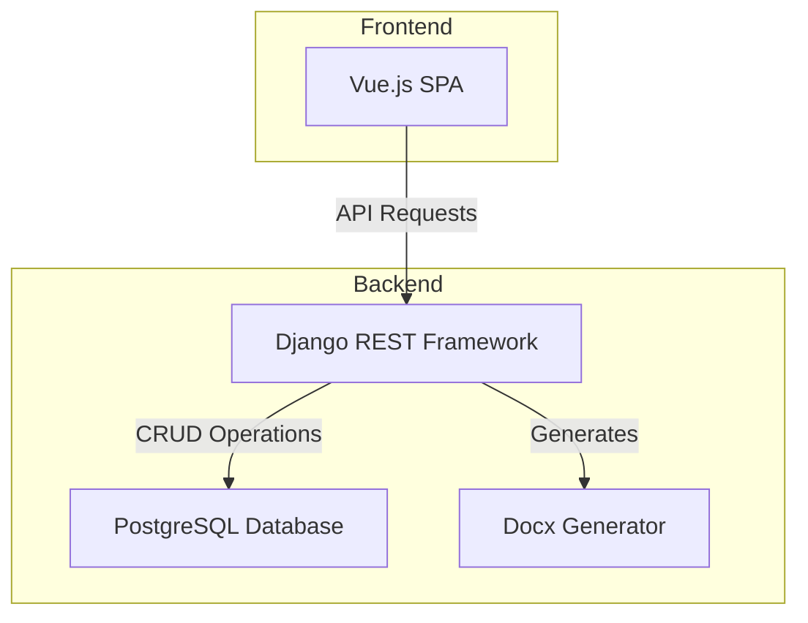
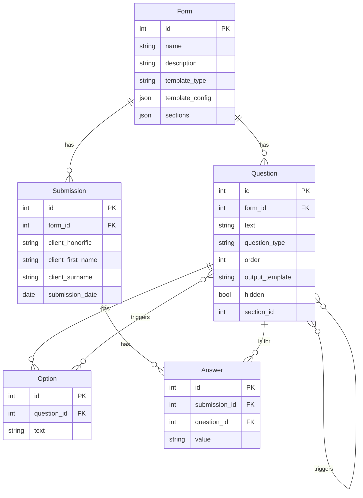
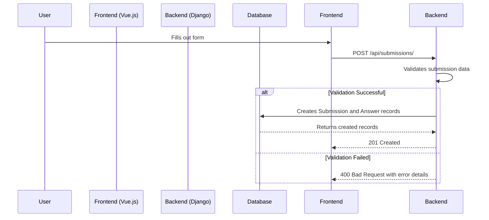

## How to run locally

```shell
uv run ./manage.py runserver
```

## System Architecture

This document provides a high-level overview of the system architecture, designed to help new engineers understand the codebase and contribute effectively.

### High-Level Architecture

The application is a full-stack solution composed of a Vue.js frontend and a Django backend. The backend serves a REST API for managing forms and submissions, and it also handles the generation of `.docx` documents based on submitted data.



### API Endpoints

The backend exposes a REST API for managing forms and submissions. The following endpoints are available:

| Method | Endpoint                  | ViewSet             | Description                                         |
|--------|---------------------------|---------------------|-----------------------------------------------------|
| GET    | `/api/forms/`             | `FormViewSet`       | Retrieve a list of all forms.                       |
| GET    | `/api/forms/{id}/`        | `FormViewSet`       | Retrieve a specific form by its ID.                 |
| POST   | `/api/forms/`             | `FormViewSet`       | Create a new form.                                  |
| PUT    | `/api/forms/{id}/`        | `FormViewSet`       | Update an existing form.                            |
| DELETE | `/api/forms/{id}/`        | `FormViewSet`       | Delete a form.                                      |
| GET    | `/api/submissions/`       | `SubmissionViewSet` | Retrieve a list of all submissions.                 |
| GET    | `/api/submissions/{id}/`  | `SubmissionViewSet` | Retrieve a specific submission by its ID.           |
| POST   | `/api/submissions/`       | `SubmissionViewSet` | Create a new submission.                            |
| PUT    | `/api/submissions/{id}/`  | `SubmissionViewSet` | Update an existing submission.                      |
| DELETE | `/api/submissions/{id}/`  | `SubmissionViewSet` | Delete a submission.                                |
| GET    | `/api/submissions/{id}/generate_doc/` | `SubmissionViewSet` | Generate a `.docx` document for a submission. |

### Database Schema

The database schema is designed to store forms, questions, submissions, and answers in a structured manner. The following diagram illustrates the relationships between the different models:



### Form Submission Workflow

The following sequence diagram illustrates the process of a user submitting a form, from interacting with the frontend to the data being saved in the backend.



### Document Generation Process

The system can generate `.docx` documents from form submissions. This process is initiated by a GET request to a specific API endpoint. The following diagram shows the workflow:

```mermaid
sequenceDiagram
    participant User
    participant Frontend (Vue.js)
    participant Backend (Django)
    participant DocGenerator
    participant Database
    User->>Frontend: Clicks "Generate Document"
    Frontend->>Backend: GET /api/submissions/{id}/generate_doc/
    Backend->>Database: Fetches Submission, Answers, and Form data
    Database-->>Backend: Returns data
    Backend->>DocGenerator: Initializes with submission data
    DocGenerator->>DocGenerator: Builds .docx file in memory
    DocGenerator-->>Backend: Returns .docx file stream
    Backend-->>Frontend: Responds with the .docx file
    Frontend-->>User: Prompts to download file